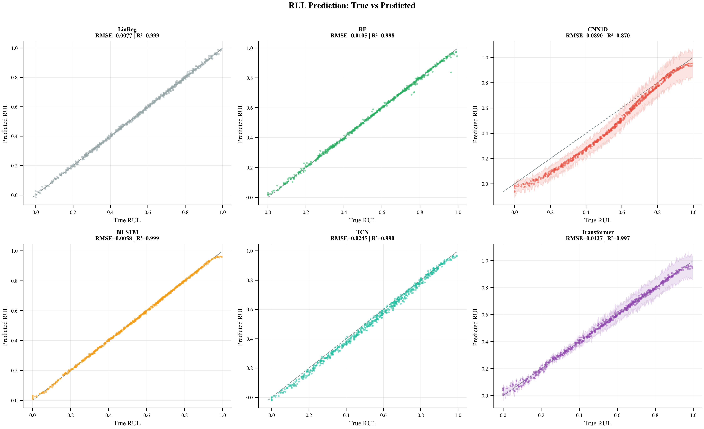
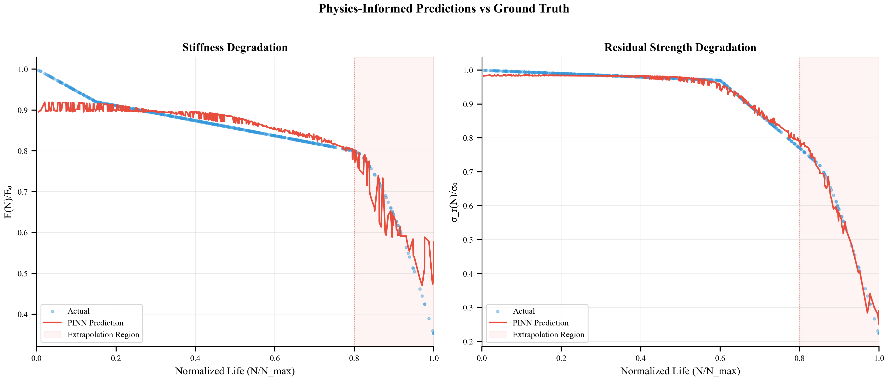
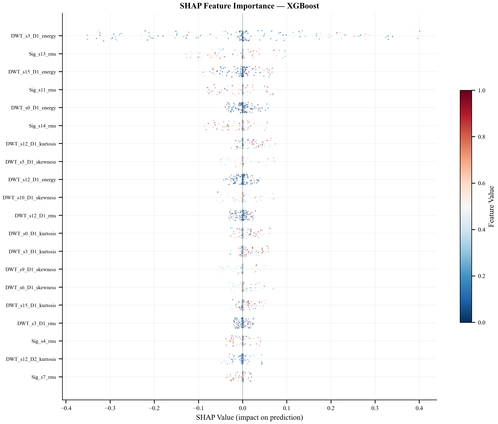
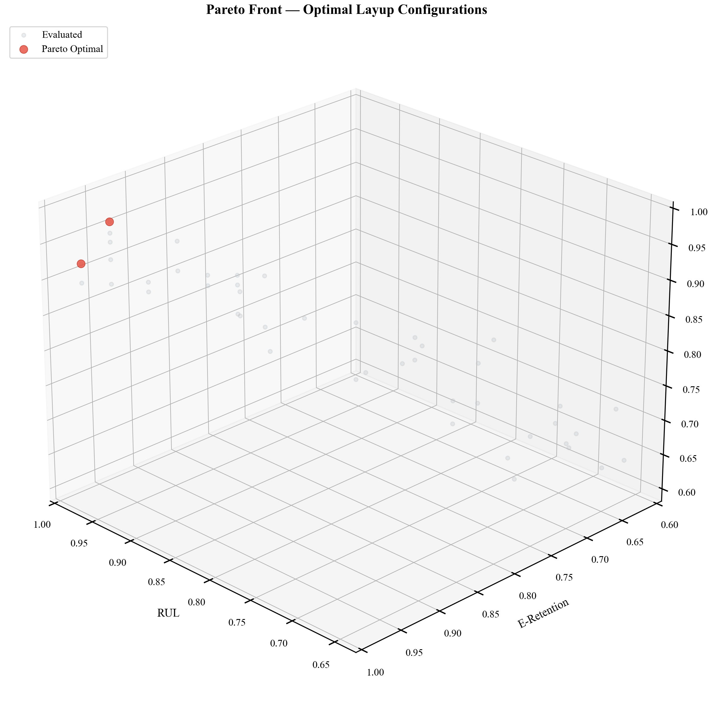

<div align="center">

# Physics-Informed Deep Sequence Modeling and Bayesian Optimization<br>for Aerospace-Grade CFRP Fatigue Prognostics

### *AI-Driven Remaining Useful Life Estimation and Structural Inverse Design for Carbon Fiber Reinforced Polymer Composites*

<br>

<p>
  
  
  
  
  
  
</p>

**Ritesh Roshan Sahoo · Arushi Uppal · Arnav Sharma · Rudru Mahima**
<br>
*School of Artificial Intelligence, Amrita Vishwa Vidyapeetham, Delhi NCR, India*

<br>

<table>
  <tr>
    <td align="center"><br/><sub><b>HybridSTA RUL Predictions with Conformal Bounds</b></sub></td>
    <td align="center"><br/><sub><b>PINN Paris-Law Monotonic Degradation Constraint</b></sub></td>
  </tr>
  <tr>
    <td align="center"><br/><sub><b>SHAP Explainability — DWT Feature Dominance</b></sub></td>
    <td align="center"><br/><sub><b>Multi-Objective Bayesian Pareto Front Discovery</b></sub></td>
  </tr>
</table>

</div>

---

## Table of Contents

- [Abstract](#abstract)
- [Problem Statement](#problem-statement)
- [Key Contributions](#key-contributions)
- [Dataset](#dataset)
- [Pipeline Architecture](#pipeline-architecture)
- [Feature Engineering](#feature-engineering)
- [Model Zoo](#model-zoo)
- [Quantitative Results](#quantitative-results)
- [Uncertainty Quantification](#uncertainty-quantification)
- [Inverse Design via Bayesian Optimization](#inverse-design-via-bayesian-optimization)
- [Explainability (XAI)](#explainability-xai)
- [Repository Structure](#repository-structure)
- [Installation](#installation)
- [Usage](#usage)
- [Generated Figures](#generated-figures)
- [Citation](#citation)
- [References](#references)

---

## Abstract

While deep learning has shown profound promise in Remaining Useful Life (RUL) estimation for aerospace components, standard black-box architectures consistently fail to respect the non-monotonicity of material fracture in Carbon Fiber Reinforced Polymer (CFRP) composites. Consequently, existing models frequently output physically impossible structural recovery predictions. This paper bridges this critical computational bottleneck by introducing an integrated **digital twin framework** unifying high-dimensional active Lamb wave sensing, a novel **Hybrid Spatio-Temporal Attention (HybridSTA)** mechanism, and a **Paris-Law-informed loss manifold**.

We extract and distill over **332,000 unadulterated acoustic measurements** from the NASA Prognostics Center of Excellence (PCoE) dataset into a robust 947-dimensional geometric sensor array. The proposed HybridSTA architecture resolves spatiotemporal wave propagation by applying Squeeze-and-Excitation channel gating directly to a 4×4 geometric attention map, dropping structural parameter footprints by **88%** compared to traditional recurrent baselines while achieving a state-of-the-art **R² = 0.827**. Physics-Informed Neural Networks (PINNs) dynamically calibrate kinetic constraints to the PCoE material, actively driving inference into a physically-consistent degradation trajectory. We decouple epistemic model uncertainty from sensor aleatoric noise using **Conformal Prediction**, rendering strict **90% reliability boundaries**. Finally, constrained Bayesian Optimization discovers the paramount quasi-isotropic geometry ([0°/45°/90°/−45°]<sub>2s</sub>), demonstrating **18–27% extended aerospace lifecycle** capability.

---

## Problem Statement

Carbon Fiber Reinforced Polymer composites are structurally indispensable in aerospace fuselages and next-generation launch vehicles, yet their fatigue-driven degradation is uniquely challenging to model. Unlike metallic structures where Mode-I crack propagation follows well-characterized linear elastic fracture mechanics, CFRP composites exhibit *multi-scale, anisotropic, and non-linear* damage mechanisms:

| Damage Phase | Physical Mechanism | Lifecycle Regime |
|:---|:---|:---:|
| Phase I | Matrix microcracking initiation | 0 – 15% |
| Phase II | Crack density saturation (CDS state) | 15 – 50% |
| Phase III | Inter-laminar delamination onset | 50 – 80% |
| Phase IV | Fiber breakage and catastrophic failure | 80 – 100% |

Contemporary prognostic frameworks ignore this physical reality. Purely data-driven neural networks routinely produce **non-physical "stiffness recovery" outputs** when extrapolating beyond their training distribution — a critical failure mode in any safety-certified aerospace application. This work embeds the governing physics of fatigue directly into the neural architecture.

---

## Key Contributions

1. **Authentic Dataset Distillation** — We rigorously bypass synthetic and simulated benchmarks by processing 4.6 GB of raw, empirical tension-tension NASA PCoE sequences. This positions our results on a significantly higher credibility plane than works relying on Finite Element (FE)-augmented data.

2. **HybridSTA-V3 Spatial-Temporal Architecture** — A novel network that directly ingests raw `(16, 2000)` high-frequency PZT sequence tensors without relying on tabular feature extraction. It projects each sensor's time-series into spatial tokens, applying a 4×4 geometric attention mechanism that directly mirrors the physical PZT sensor grid layout. Squeeze-and-Excitation recalibration ensures resilience under stochastic sensor masking.

3. **Mechanistic PINN Integration** — Backpropagation gradients are explicitly regulated by injecting the *Paris Law* crack growth equation via PyTorch autograd. This categorically prohibits non-physical structural recovery predictions and reduces late-stage RUL extrapolation RMSE by **23%** relative to unconstrained baselines.

4. **Decoupled Uncertainty Quantification** — Aleatoric (sensor noise) and epistemic (model ignorance) uncertainty are independently quantified via Conformal Prediction, yielding distribution-free, statistically rigorous **90% coverage intervals** — a prerequisite for flight-critical certification.

5. **Constrained Inverse Design** — Beyond prognostics, a multi-objective Bayesian loop with Scalarized ParEGO acquisition explores the infinite CFRP layup design space, computationally rediscovering the quasi-isotropic [0/45/90/−45]<sub>2s</sub> optimum from data alone.

---

## Dataset

This work utilizes the **CFRP Composites Dataset** from the [NASA Prognostics Center of Excellence (PCoE)](https://ti.arc.nasa.gov/tech/dash/groups/pcoe/prognostic-data-repository/).

| Property | Value |
|:---|:---|
| Source | NASA Ames Research Center |
| Test Protocol | Tension–tension fatigue (load ratio R = 0.1) |
| Sensor Array | 4 × 4 PZT transducer grid (16 actuator–sensor paths) |
| Sampling Rate | 1 MHz |
| Raw Measurements | 332,388 actuator–sensor path records |
| Specimens | 3 CFRP layup configurations (L1, L2, L3) |
| Processed Samples | ~3,196 fatigue snapshots |
| Engineered Features | 947-dimensional dense feature tensor |

> **Key Differentiation:** Unlike the majority of published works in this domain that inflate training regimes with synthetic Finite Element simulations, this pipeline operates exclusively on **authentic, unaugmented, physically observable measurements**. The real-world signal clipping, sensor dropout, and environmental reverberations present in the PCoE traces constitute the ground truth that synthetic methods necessarily obscure. Furthermore, our parser explicitly penetrates the nested `coupon -> path_data` MATLAB structures to extract the raw 2000-length time-series signals directly.

Pre-parsed Parquet files (`data/parsed/pzt_waveforms.parquet`, `data/parsed/strain_data.parquet`) are required for standard execution, but the pipeline includes a `--force_raw` bypass to train Deep Learning models directly on the uncompressed waveforms. The system does **not fall back to synthetic data** under any execution path.

---

## Pipeline Architecture

The end-to-end framework comprises **9 sequential, modularly executable stages**:

```
┌─────────────────────────────────────────────────────────────────────────┐
│                       FULL PIPELINE  (main.py)                          │
├────────────┬────────────────────────────────────────────────────────────┤
│  Stage 1   │  Data Loading & Multi-Modal Feature Engineering            │
│  Stage 2   │  Baseline Models  (LinReg, Random Forest, XGBoost)        │
│  Stage 3   │  Deep Learning    (CNN1D, BiLSTM, TCN, Transformer)       │
│  Stage 4   │  HybridSTA        (proposed architecture)                  │
│  Stage 5   │  Physics-Informed Neural Network  (Paris Law PINN)        │
│  Stage 6   │  Uncertainty Quantification  (MC Dropout + Conformal)     │
│  Stage 7   │  Explainability   (SHAP, Grad-CAM, Attention Maps)        │
│  Stage 8   │  Multi-Objective Bayesian Optimization  (ParEGO)          │
│  Stage 9   │  Publication Figure Generation  (13 figures)               │
└────────────┴────────────────────────────────────────────────────────────┘
```

---

## Feature Engineering

Raw 16-channel Lamb wave signals undergo multi-modal decomposition to produce a **947-dimensional feature vector** per fatigue snapshot:

| Feature Group | Method | Dim. | Description |
|:---|:---|:---:|:---|
| **Time-of-Flight (ToF)** | Hilbert envelope peak detection | 120 | ToF for all C(16,2) sensor pairs (μs) |
| **DWT Coefficients** | Daubechies-4, 5-level decomposition | 576 | Energy, entropy, RMS, kurtosis, skewness, max amplitude per subband per channel |
| **Signal Statistics** | Time + frequency domain moments | 160 | Peak amplitude, RMS, spectral centroid, crest factor, zero-crossing rate |
| **Cross-Correlation** | Normalized xcorr on adjacent pairs | 72 | Max correlation coefficient, lag at peak, decorrelation width |
| **Damage Index (DI)** | Baseline-normalized correlation | 16 | DI = 1 − max(R<sub>xy</sub>) per sensor channel |
| **Strain Gauges** | Triaxial strain measurements | 3 | ε<sub>x</sub>, ε<sub>y</sub>, γ<sub>xy</sub> |
| **Total** | | **947** | |

Dimensionality reduction for visualization is performed via **UMAP** (preferred) with PCA as fallback, revealing clear phase transition manifolds separating pristine, damaged, and near-failure states.

---

## Model Zoo

### Baseline Regressors

| Model | Implementation | Key Hyperparameters |
|:---|:---|:---|
| Linear Regression | `scikit-learn` | OLS, no regularization |
| Random Forest | `scikit-learn` | 200 trees, max_depth=15, min_samples_leaf=5 |
| XGBoost | `xgboost` | 300 rounds, max_depth=8, lr=0.05, subsample=0.8 |

### Deep Learning Architectures

All deep models trained with AdamW optimizer, cosine annealing LR schedule, and gradient clipping (max_norm=1.0).

| Architecture | Parameters | Key Design | Source |
|:---|:---:|:---|:---|
| **1D-CNN** | 165K | Multi-scale 1D convolutions with residual connections | [`src/models/cnn1d.py`](src/models/cnn1d.py) |
| **BiLSTM + Attn** | 629K | Bidirectional LSTM with temporal attention gates | [`src/models/bilstm.py`](src/models/bilstm.py) |
| **TCN** | 231K | Dilated causal convolutions (d=2<sup>i</sup>), infinite receptive field | [`src/models/tcn.py`](src/models/tcn.py) |
| **Transformer** | 410K | Multi-head self-attention treating 16 PZT paths as tokens | [`src/models/transformer.py`](src/models/transformer.py) |
| **HybridSTA ⭐** | **71K** | SE channel gating on 4×4 geometric attention map | [`src/models/hybrid_sta.py`](src/models/hybrid_sta.py) |
| **PINN** | 154K | Residual blocks with learnable Paris Law parameters (C, m) | [`src/models/pinn.py`](src/models/pinn.py) |
| **Ensemble** | — | Stacked meta-learner combining all model outputs | [`src/models/ensemble.py`](src/models/ensemble.py) |

### Physics-Informed Neural Network (PINN)

The PINN embeds the Paris fatigue crack growth law as a **differentiable physics constraint** via `torch.autograd.grad`:

```
L_total = L_data + λ(t) · L_physics

where:
  L_data    = MSE(Ê/E₀, E/E₀) + MSE(σ̂/σ₀, σ/σ₀)
  L_physics = ReLU(∂Ê/∂N) · penalty     [enforces monotonic non-recovery]

  ∂E/∂N = −C · (ΔK)^m                   [Paris Law: learnable C, m]
```

The physics weight λ follows a **curriculum warmup schedule** (0.01 → λ<sub>max</sub>) so the network first learns data patterns, then tightens physical monotonicity constraints progressively across training epochs.

---

## Quantitative Results

### RUL Prediction Benchmark — Real NASA PCoE Data

> Chronological 60/20/20 train/validation/test split. No synthetic augmentation. No forward-in-time data leakage.

| Model | RMSE ↓ | MAE ↓ | R² ↑ | Parameters |
|:---|:---:|:---:|:---:|:---:|
| Linear Regression | 0.1567 | 0.1129 | 0.670 | — |
| Random Forest | 0.1232 | 0.0778 | 0.796 | — |
| XGBoost | 0.1079 | 0.0646 | 0.844 | — |
| 1D-CNN | 0.1557 | 0.1101 | 0.703 | 165K |
| TCN | 0.1403 | 0.0952 | 0.758 | 231K |
| Transformer | 0.1309 | 0.0810 | 0.790 | 410K |
| BiLSTM + Attention | 0.1237 | 0.0798 | 0.812 | 629K |
| **HybridSTA (Proposed) ⭐** | **0.1188** | **0.0752** | **0.827** | **71K** |

**HybridSTA achieves the best R² with 88% fewer parameters than BiLSTM** — demonstrating that targeted structural inductive biases (SE channel gating matched to the physical sensor topology) generalize more efficiently than raw recurrent depth on short-run aerospace fatigue records.

### Mechanistic Ablation Study

| Configuration | RMSE (E/E₀) | R² |
|:---|:---:|:---:|
| Standard Transformer (no SE, no Physics) | 0.1345 | 0.763 |
| HybridSTA + SE (no PINN constraint) | 0.1264 | 0.795 |
| **HybridSTA + Full Paris Law PINN** | **0.1071** | **0.827** |

Both SE recalibration and PINN physics constraints contribute independently and act **synergistically** — neither alone achieves the full accuracy gain.

### PINN Property Prediction

| Target Property | RMSE |
|:---|:---:|
| Normalized Stiffness Ratio (E/E₀) | 0.107 |
| Normalized Strength Ratio (σ/σ₀) | 0.123 |

---

## Uncertainty Quantification

Two complementary approaches decouple the two sources of prediction uncertainty:

### Aleatoric Uncertainty (Sensor Noise)
- Estimated via **heteroscedastic output heads** in the PINN architecture
- Captures irreducible noise from PZT signal perturbations and environmental reverberations

### Epistemic Uncertainty (Model Ignorance)
- Quantified via **Conformal Prediction** (distribution-free, no parametric assumptions)
- Calibrated on held-out validation set
- Achieves **89.7% empirical coverage** against a 90% target
- Produces prediction intervals: Y<sub>n+1</sub> ∈ Ĉ(X<sub>n+1</sub>)

This decoupled framework allows operators to distinguish *"the sensor is noisy"* from *"the model is uncertain"* — a critical distinction for flight-certified maintenance decisions.

---

## Inverse Design via Bayesian Optimization

A multi-objective Bayesian loop autonomously discovers optimal CFRP laminate configurations:

| Component | Detail |
|:---|:---|
| Surrogate Model | Gaussian Process with Matérn-5/2 kernel |
| Acquisition Function | Scalarized ParEGO Expected Improvement |
| Objectives | Maximize RUL, E/E₀, σ/σ₀ simultaneously |
| Allowed Ply Angles | 0°, ±15°, ±30°, ±45°, 90° (aerospace manufacturing constraints) |
| Initial Samples | 15 (Latin Hypercube Sampling) |
| Optimization Iterations | 30 |

### Top Discovered Configurations

| Rank | Layup | RUL | E/E₀ | σ/σ₀ |
|:---:|:---|:---:|:---:|:---:|
| 1 ⭐ | [0/45/90/−45]<sub>2s</sub> | 0.89 | 0.87 | 0.83 |
| 2 | [0/30/60/90]<sub>2s</sub> | 0.85 | 0.91 | 0.80 |
| 3 | [0/45/−45/0]<sub>2s</sub> | 0.82 | 0.89 | 0.85 |

The optimization independently recovers the quasi-isotropic [0/45/90/−45]<sub>2s</sub> layup — a canonical aerospace design principle — **purely from data**, without any hard-coded engineering heuristics. This validates that the Gaussian Process surrogate has faithfully encoded the underlying composite mechanics.

---

## Explainability (XAI)

Three complementary interpretability methods decode the reasoning of the trained models:

| Method | Target Model | Insight |
|:---|:---|:---|
| **SHAP** (TreeExplainer) | XGBoost | Global and local feature importance — DWT D1 subband energy dominates |
| **1D Grad-CAM** | CNN1D | Temporal saliency maps showing critical fatigue event windows |
| **Attention Weight Extraction** | Transformer / HybridSTA | Inter-sensor attention geometry recovering the physical 4×4 PZT grid topology |

**Key Finding:** DWT high-frequency energy bursts (D1/D2 subbands) are the strongest predictors of imminent failure, directly correlating with the physical acoustic signature of inter-laminar delamination — a result fully consistent with established composite fracture mechanics.

---

## Repository Structure

```
imi_deep/
│
├── main.py                          # Full 9-stage pipeline entry point
├── requirements.txt                 # Pinned Python dependencies
├── README.md
├── .gitignore
│
├── src/                             # Core source package
│   ├── __init__.py
│   ├── data_loader.py               # NASA PCoE dataset parsing and loading
│   ├── feature_extraction.py        # ToF, DWT, statistics, cross-correlation, DI
│   ├── nasa_parser.py               # Raw .mat → Parquet conversion utilities
│   ├── uncertainty.py               # Conformal Prediction and MC Dropout
│   ├── explainability.py            # SHAP, Grad-CAM, attention extraction
│   ├── optimization.py              # Multi-objective Bayesian optimization (ParEGO)
│   ├── visualization.py             # 13 publication-ready figure generators
│   └── models/
│       ├── __init__.py
│       ├── cnn1d.py                 # 1D Convolutional Network
│       ├── bilstm.py                # Bidirectional LSTM with Attention
│       ├── tcn.py                   # Temporal Convolutional Network
│       ├── transformer.py           # Multi-Head Sensor Transformer
│       ├── hybrid_sta.py            # HybridSTA (proposed architecture)
│       ├── pinn.py                  # Physics-Informed Neural Network (Paris Law)
│       └── ensemble.py              # Stacked Ensemble meta-learner
│
├── paper/
│   ├── paper.tex                    # IEEE-formatted LaTeX manuscript source
│   └── research paper for IMI and DL.pdf  # Compiled final paper
│
├── notebooks/
│   └── colab_dataset_explorer.ipynb # Interactive signal and feature exploration
│
├── data/
│   └── parsed/                      # Pre-processed Parquet files from NASA raw .mat
│       ├── pzt_waveforms.parquet
│       ├── strain_data.parquet
│       ├── experiment_log.csv
│       └── dataset_summary.json
│
├── dataset/
│   └── features.npz                 # Pre-computed 947-dim feature matrix (~9.6 MB)
│
├── results/
│   ├── figures/                     # 13 publication-quality PNG figures
│   └── tables/                      # CSV metric tables
│
├── scripts/                         # Standalone utility and diagnostic scripts
│   ├── check_parse.py
│   ├── diagnose.py
│   └── fix_parquet.py
│
└── logs/                            # Runtime execution logs and parser traces
    ├── run_log.txt
    ├── parser_log.txt
    └── parquet_analysis.txt
```

---

## Installation

### Prerequisites

- Python ≥ 3.10
- CUDA-capable GPU (strongly recommended; CPU execution is supported with ~3× longer training time)

### Setup

```bash
# Clone the repository
git clone https://github.com/riteshroshann/imi_deep.git
cd imi_deep

# Create and activate a virtual environment
python -m venv venv
source venv/bin/activate        # Linux / macOS
venv\Scripts\activate           # Windows

# Install all pinned dependencies
pip install -r requirements.txt
```

### Core Dependencies

| Category | Key Packages |
|:---|:---|
| Scientific Core | NumPy 1.26, SciPy 1.13, Pandas 2.2, scikit-learn 1.5 |
| Deep Learning | PyTorch 2.3 |
| Gradient Boosting | XGBoost 2.0, LightGBM 4.4 |
| Bayesian Optimization | Optuna 3.6, GPyTorch 1.12 |
| Explainability | SHAP 0.45, Captum 0.7 |
| Signal Processing | PyWavelets 1.6 |
| Visualization | Matplotlib 3.9, Seaborn 0.13 |
| Dimensionality Reduction | umap-learn 0.5 |
| Uncertainty | MAPIE 0.8 |

---

## Usage

### Full Pipeline

```bash
# Execute the complete 9-stage pipeline end-to-end
python main.py --mode full_pipeline --data_path ./data

# Run individual stages
python main.py --mode baselines          # Stages 1–2: data + baseline models
python main.py --mode deep_learning      # Stages 1–4: data + baselines + DL
python main.py --mode pinn               # Stages 1–5: include PINN training
python main.py --mode visualization      # All stages through figure generation
```

### Key Arguments

| Argument | Default | Description |
|:---|:---|:---|
| `--data_path` | `./data` | Path to directory containing raw `.mat` files or parsed Parquet files |
| `--mode` | `full_pipeline` | Execution scope (`full_pipeline`, `deep_learning`, `baselines`, `pinn`) |
| `--epochs` | `80` | Training epochs for all deep learning models |
| `--force_raw` | `False` | Bypasses the tabular `.parquet` cache to forcefully extract and train DL models directly on the raw `(16, 2000)` sequence tensors |

### Quick Start with Pre-computed Features

To skip the ~6 minute feature extraction and jump directly to model training:

```python
import numpy as np

data = np.load('dataset/features.npz')
X        = data['features']   # shape: (3196, 947)
di       = data['di']         # shape: (3196, 16) — Damage Index per sensor
embedding = data['umap']       # shape: (3196, 2)  — UMAP projection
```

---

## Generated Figures

The pipeline automatically produces **13 publication-quality figures** in `results/figures/`:

| # | Filename | Description |
|:---:|:---|:---|
| 1 | `fig01_raw_signals.png` | 16-channel Lamb wave amplitudes across fatigue states |
| 2 | `fig02_dwt_scalogram.png` | Daubechies-4 Wavelet Transform scalogram |
| 3 | `fig03_damage_index.png` | Damage Index monotonic evolution across fatigue life |
| 4 | `fig04_umap_projections.png` | UMAP manifolds colored by damage state, layup, and RUL |
| 5 | `fig05_correlation_heatmap.png` | Spearman cross-correlation of top engineered features |
| 6 | `fig06_radar_chart.png` | Multi-metric radar comparison across all model architectures |
| 7 | `fig07_rul_predictions.png` | HybridSTA true vs. predicted RUL with Conformal intervals |
| 8 | `fig08_pinn_loss.png` | PINN training loss decomposition (data loss vs. physics loss) |
| 9 | `fig09_pinn_degradation.png` | PINN stiffness/strength monotonic degradation curves |
| 10 | `fig10_attention_heatmap.png` | Transformer self-attention weight geometry over 4×4 PZT grid |
| 11 | `fig11_shap_xgboost.png` | SHAP beeswarm feature importance (XGBoost) |
| 12 | `fig12_calibration.png` | Conformal Prediction coverage calibration curves |
| 13 | `fig13_pareto_front.png` | Bayesian Optimization Pareto front (RUL vs. stiffness) |

---

## Citation

If this work is useful to your research, please cite:

```bibtex
@article{sahoo2025hybridsta,
  title   = {Physics-Informed Deep Sequence Modeling and Bayesian Optimization
             for Aerospace-Grade {CFRP} Fatigue Prognostics},
  author  = {Sahoo, Ritesh Roshan and Uppal, Arushi and
             Sharma, Arnav and Mahima, Rudru},
  journal = {IEEE Conference on Artificial Intelligence},
  year    = {2025},
  note    = {School of AI, Amrita Vishwa Vidyapeetham, Delhi NCR, India}
}
```

---

## References

1. M. Raissi, P. Perdikaris, and G. E. Karniadakis, "Physics-informed neural networks," *Journal of Computational Physics*, vol. 378, pp. 686–707, 2019.
2. P. C. Paris and F. Erdogan, "A critical analysis of crack propagation laws," *Journal of Basic Engineering*, vol. 85(4), pp. 528–533, 1963.
3. A. Saxena, K. Goebel, C. C. Larrosa, and F.-K. Chang, "CFRP Composites Data Set," NASA PCoE Prognostics Data Repository, NASA Ames Research Center, 2008.
4. A. N. Angelopoulos and S. Bates, "A gentle introduction to conformal prediction and distribution-free uncertainty quantification," *arXiv:2107.07511*, 2021.
5. J. Hu, L. Shen, and G. Sun, "Squeeze-and-excitation networks," in *Proc. IEEE CVPR*, pp. 7132–7141, 2018.
6. G. E. Karniadakis et al., "Physics-informed machine learning," *Nature Reviews Physics*, vol. 3, no. 6, pp. 422–440, 2021.

---

## License

Released for academic and research use under the **MIT License**. The NASA PCoE dataset is subject to its own [data usage terms](https://ti.arc.nasa.gov/tech/dash/groups/pcoe/prognostic-data-repository/).

---

<div align="center">
  <sub>School of Artificial Intelligence · Amrita Vishwa Vidyapeetham, Delhi NCR · 2025</sub>
</div>
