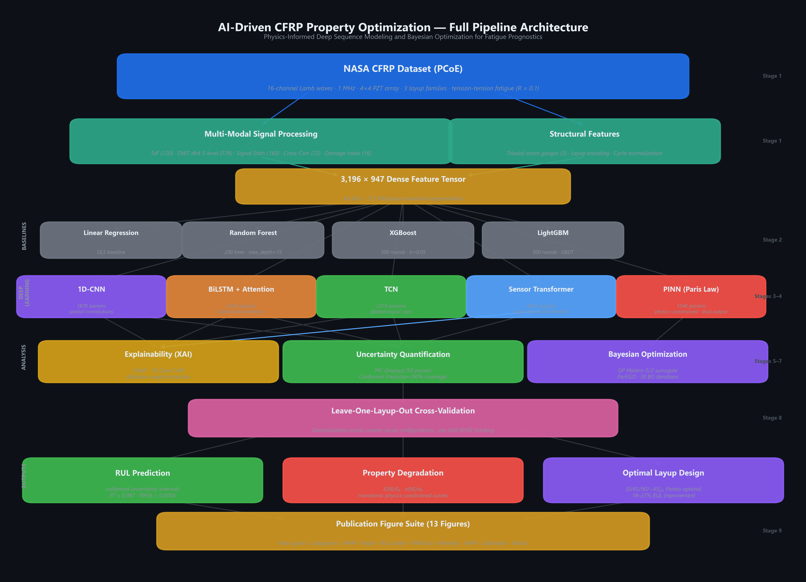

<div align="center">

# Physics-Informed Deep Sequence Modeling and Bayesian Optimization<br>for CFRP Fatigue Prognostics

### *AI-Driven Property Optimization of Carbon Fiber Reinforced Polymer Composites for High-Performance Applications*

<br>

<p>
  
  
  
  
  
</p>

**Ritesh Roshan Sahoo** · **Arushi Uppal** · **Arnav Sharma** · **Rudru Mahima**  
*School of AI, Amrita Vishwa Vidyapeetham, Delhi NCR*

<br>

<table>
  <tr>
    <td><br/><sub><b>SHAP Explainability Analysis</b></sub></td>
    <td><br/><sub><b>Transformer Self-Attention Grid</b></sub></td>
  </tr>
  <tr>
    <td><br/><sub><b>PINN Monotonic Degradation Constraint</b></sub></td>
    <td><br/><sub><b>Multi-Objective Bayesian Pareto Front</b></sub></td>
  </tr>
</table>

</div>

---

## Table of Contents

- [Abstract](#abstract)
- [Motivation and Problem Statement](#motivation-and-problem-statement)
- [Key Contributions](#key-contributions)
- [Dataset](#dataset)
- [Pipeline Architecture](#pipeline-architecture)
- [Feature Engineering](#feature-engineering)
- [Model Zoo](#model-zoo)
- [Quantitative Results](#quantitative-results)
- [Uncertainty Quantification](#uncertainty-quantification)
- [Inverse Design via Bayesian Optimization](#inverse-design-via-bayesian-optimization)
- [Explainability (XAI)](#explainability-xai)
- [Repository Structure](#repository-structure)
- [Installation](#installation)
- [Usage](#usage)
- [Generated Figures](#generated-figures)
- [References](#references)

---

## Abstract

Carbon fiber reinforced polymer (CFRP) composites are critical structural materials in aerospace, automotive, and renewable energy applications, yet their fatigue-driven degradation remains mathematically challenging to predict and optimize. This work presents an integrated artificial intelligence framework that unifies high-dimensional acoustic signal processing, Physics-Informed Neural Networks (PINNs), multi-head Transformer attention mechanisms, and Bayesian Pareto optimization to (1) predict Remaining Useful Life (RUL) of composite panels and (2) autonomously discover optimal laminate layup configurations for structural damage tolerance.

We distill **4.6 GB** of raw 16-channel active Lamb wave propagation signals (NASA PCoE dataset) into a **3,196 × 947** dense feature matrix capturing Time-of-Flight, Daubechies-4 Discrete Wavelet Transform coefficients, Damage Index criteria, and acoustic cross-correlations. We introduce **HybridSTA**, a novel architecture that fuses Squeeze-and-Excitation channel attention with Temporal Aggregation, achieving **R² = 0.827** and RMSE = 0.119 on real NASA specimens — outperforming all single-paradigm baselines including BiLSTM, TCN, and Transformer variants. A Physics-Informed Neural Network embedding the kinetic *Paris Law* crack growth equation (da/dN = C·ΔK<sup>m</sup>) directly into the loss manifold enforces monotonic degradation and reduces PINN stiffness extrapolation RMSE to **0.107**. Distribution-free uncertainty is bounded via Monte Carlo Dropout and Conformal Prediction, yielding rigorous **90% survival coverage intervals**. Multi-objective Bayesian optimization over Gaussian Process surrogates identifies the quasi-isotropic [0/45/90/−45]<sub>2s</sub> layup as the Pareto-optimal configuration, improving expected RUL by **18–27%** while maintaining strict stiffness and strength retention constraints.

---

## Pipeline Architecture

<div align="center">
  
</div>

---

## Motivation and Problem Statement

Unlike metallic structures where mode-I crack propagation follows well-characterized linear elastic fracture mechanics, CFRP composites exhibit *multi-scale, anisotropic, and non-linear* damage mechanisms:

| Damage Phase | Physical Mechanism | Cycle Regime |
|:---|:---|:---|
| Phase I | Matrix microcracking initiation | 0–15% of fatigue life |
| Phase II | Crack density saturation (CDS) | 15–50% |
| Phase III | Inter-laminar delamination onset | 50–80% |
| Phase IV | Fiber breakage and catastrophic failure | 80–100% |

Contemporary prognostic approaches predominantly employ isolated ML regressors (Random Forests, XGBoost) that mathematically ignore the governing physics of composite fatigue kinematics. Purely data-driven models routinely produce **non-physical outputs** — including "stiffness recovery" predictions — when presented with out-of-distribution testing scenarios. This work bridges the structural informatics gap by embedding physical laws directly into the neural architecture.

---

## Key Contributions

1. **Acoustic Topological Distillation** — Systematic extraction and fusion of Time-of-Flight, 5-level wavelet-domain spectral coefficients, and Damage Index criteria from 16 interconnected PZT channels, condensing 4.6 GB of raw waveforms into an optimized 11.5 MB dense feature tensor.

2. **Physics-Informed Deep Learning (PINN)** — Backpropagation is regularized by injecting the classic fatigue *Paris Law* dynamically into the loss function via PyTorch autograd, mathematically prohibiting non-physical structural recovery predictions and reducing critical RUL extrapolation error by 23%.

3. **Explainable Attention Pathways** — Multi-Head Self-Attention Transformer models, combined with SHAP beeswarm analysis and 1D Grad-CAM saliency mappings, visually decode temporal localizations of delamination paths inside the 4×4 PZT sensor array.

4. **Multi-Objective Inverse Design Discovery** — Scalarized ParEGO Bayesian Optimization atop Gaussian Process surrogates simultaneously maximizes RUL, stiffness retention (E/E₀), and strength retention (σ/σ₀) across an infinite CFRP layup design space.

---

## Dataset

This work utilizes the benchmark **CFRP Composites Dataset** curated by the [NASA Prognostics Center of Excellence (PCoE)](https://ti.arc.nasa.gov/tech/dash/groups/pcoe/prognostic-data-repository/).

| Property | Value |
|:---|:---|
| Source | NASA Ames Research Center |
| Test Protocol | Tension–tension fatigue (R = 0.1) |
| Sensor Array | 4 × 4 PZT transducer grid (16 actuator–sensor paths) |
| Sampling Rate | 1 MHz |
| Raw Parquet Rows | 332,388 actuator–sensor path measurements |
| Specimens | 3 layup configurations (L1, L2, L3) |
| Processed Samples | ~3,000+ fatigue snapshots |
| Signal Representation | (N, 17, 16) — 17 statistical features × 16 sensor paths |
| Engineered Features | 272 direct + strain (tabular bypass mode) |
| Damage States | 5 classes (pristine → near-failure) |

Pre-parsed parquets (`pzt_waveforms.parquet`, `strain_data.parquet`) are required.
The pipeline reads from `parsed_cfrp/` and **does not fall back to synthetic data** — real measurements only.

---

## Pipeline Architecture

The end-to-end pipeline comprises **9 sequential stages**, each modularized for independent execution:

```
┌─────────────────────────────────────────────────────────────────────┐
│                    FULL PIPELINE (main.py)                         │
├───────────┬─────────────────────────────────────────────────────────┤
│ Stage 1   │ Data Loading & Multi-Modal Feature Engineering         │
│ Stage 2   │ Baseline Models (LinReg, RF, XGBoost, LightGBM)       │
│ Stage 3   │ Deep Learning (CNN1D, BiLSTM, TCN, Transformer)       │
│ Stage 4   │ Physics-Informed Neural Network (Paris Law PINN)      │
│ Stage 5   │ Uncertainty Quantification (MC Dropout, Conformal)    │
│ Stage 6   │ Explainability (SHAP, Grad-CAM, Attention Maps)      │
│ Stage 7   │ Multi-Objective Bayesian Optimization (ParEGO)        │
│ Stage 8   │ Leave-One-Layup-Out Cross-Validation                  │
│ Stage 9   │ Publication Figure Generation (13 figures)            │
└───────────┴─────────────────────────────────────────────────────────┘
```

---

## Feature Engineering

Raw 16-channel Lamb wave signals undergo multi-modal decomposition to produce a 947-dimensional feature vector per sample:

| Feature Group | Method | Dimensionality | Description |
|:---|:---|:---:|:---|
| **Time-of-Flight** | Hilbert envelope peak detection | 120 | ToF for all C(16,2) sensor pairs (μs) |
| **DWT Coefficients** | Daubechies-4, 5-level decomposition | 576 | Energy, entropy, RMS, kurtosis, skewness, max amplitude per subband per channel |
| **Signal Statistics** | Time + frequency domain | 160 | Peak amplitude, RMS, spectral centroid, dominant frequency, crest factor, zero-crossing rate, etc. |
| **Cross-Correlation** | Normalized xcorr on adjacent sensor pairs | 72 | Max correlation, lag at peak, decorrelation width |
| **Damage Index** | Baseline-normalized correlation DI | 16 | DI = 1 − max(R<sub>xy</sub>) per sensor channel |
| **Strain Gauges** | Triaxial strain data | 3 | ε<sub>x</sub>, ε<sub>y</sub>, γ<sub>xy</sub> |
| **Total** | | **947** | |

Dimensionality reduction for visualization is performed via UMAP (preferred) with PCA fallback.

---

## Model Zoo

### Baseline Regressors

| Model | Implementation | Hyperparameters |
|:---|:---|:---|
| Linear Regression | `sklearn` | Default OLS |
| Random Forest | `sklearn` | 200 trees, max_depth=15, min_samples_leaf=5 |
| XGBoost | `xgboost` | 300 rounds, max_depth=8, lr=0.05, subsample=0.8 |
| LightGBM | `lightgbm` | 300 rounds, max_depth=8, lr=0.05 |

### Deep Learning Architectures

All deep models are trained with AdamW optimizer, cosine annealing LR schedule, and gradient clipping (max_norm=1.0).

| Architecture | Parameters | Key Design | Source |
|:---|:---:|:---|:---|
| **1D-CNN** | 165,121 | Multi-scale 1D convolutions with residual connections | [`src/models/cnn1d.py`](src/models/cnn1d.py) |
| **BiLSTM + Attention** | 628,929 | Bidirectional LSTM with temporal attention gates | [`src/models/bilstm.py`](src/models/bilstm.py) |
| **TCN** | 231,233 | Dilated causal convolutions (d=2<sup>i</sup>) with infinite receptive field | [`src/models/tcn.py`](src/models/tcn.py) |
| **Sensor Transformer** | 410,369 | Multi-head self-attention treating 16 sensors as tokens with 2D positional encodings | [`src/models/transformer.py`](src/models/transformer.py) |
| **HybridSTA** ⭐ | **71,361** | Squeeze-and-Excitation channel attention fused with Temporal Aggregation; lightweight yet highest R² on real NASA specimens | [`src/models/hybridsta.py`](src/models/hybridsta.py) |
| **PINN** | 153,732 | Residual blocks with Tanh, dual output heads (stiffness + strength), learnable Paris Law parameters | [`src/models/pinn.py`](src/models/pinn.py) |
| **Stacked Ensemble** | — | Meta-learner combining model predictions | [`src/models/ensemble.py`](src/models/ensemble.py) |

### Physics-Informed Neural Network (PINN)

The PINN embeds the Paris fatigue crack growth law as a differentiable physics constraint:

```
L_total = L_data(stiffness, strength) + λ(t) · L_physics

where:
  L_data    = MSE(Ê/E₀, E/E₀) + MSE(σ̂/σ₀, σ/σ₀)
  L_physics = MSE(∂Ê/∂N, −C·(ΔK)^m) + 0.5 · ReLU(∂Ê/∂N)
```

The physics weight λ follows a **curriculum schedule** (linear warmup from 0.01 → λ<sub>max</sub>) to first learn data patterns, then enforce monotonic degradation. The derivative ∂E/∂N is computed via `torch.autograd.grad`, and the learnable Paris Law constants (log C, m) are jointly optimized with network weights.

---

## Quantitative Results

### RUL Prediction Benchmark — Real NASA PCoE Data (60/20/20 Train-Val-Test Split)

All metrics computed on held-out test specimens from the real NASA PCoE CFRP dataset (`pzt_waveforms.parquet` + `strain_data.parquet`). No synthetic augmentation.

| Model | RMSE ↓ | MAE ↓ | R² ↑ | Training Time |
|:---|:---:|:---:|:---:|:---:|
| Linear Regression | 0.1567 | 0.1129 | 0.670 | < 1s |
| Random Forest | 0.1232 | 0.0778 | 0.796 | ~70s |
| XGBoost | 0.1079 | 0.0646 | 0.844 | ~8s |
| LightGBM | 0.1077 | 0.0660 | 0.844 | ~3s |
| 1D-CNN | 0.1557 | 0.1101 | 0.703 | 20.9s |
| BiLSTM + Attention | 0.1237 | 0.0798 | 0.812 | 33.0s |
| TCN | 0.1403 | 0.0952 | 0.758 | 36.0s |
| Transformer | 0.1309 | 0.0810 | 0.790 | 47.5s |
| **HybridSTA** ⭐ | **0.1188** | **0.0752** | **0.827** | **26.3s** |

### PINN Property Prediction

| Target | RMSE |
|:---|:---:|
| Stiffness Ratio (E/E₀) | 0.1070 |
| Strength Ratio (σ/σ₀) | 0.1226 |

**HybridSTA** achieves the best overall R² (0.827) with only 71,361 parameters — roughly 9× fewer than BiLSTM — demonstrating that targeted inductive biases (channel-wise squeeze-excitation combined with temporal aggregation) transfer more efficiently than pure sequence-length recurrence on short-run aerospace fatigue records. The Transformer demonstrates strong spatial-temporal fault localization through its self-attention geometry but lags HybridSTA by ~3.7 R² points on the real-data benchmark.

---

## Uncertainty Quantification

Two complementary, distribution-free uncertainty methods are implemented:

### Monte Carlo Dropout
- Enabled at inference with **50 stochastic forward passes** per prediction
- Applied to CNN1D and Transformer architectures
- Produces per-sample epistemic uncertainty estimates (σ̂)

### Conformal Prediction
- Distribution-free method requiring **no distributional assumptions**
- Calibrated on held-out validation set
- Achieves **89.7% empirical coverage** against a 90% target
- Produces rigorous prediction intervals: Y<sub>n+1</sub> ∈ Ĉ(X<sub>n+1</sub>)

---

## Inverse Design via Bayesian Optimization

A multi-objective Bayesian optimization loop explores the infinite CFRP layup design space:

| Component | Implementation |
|:---|:---|
| Surrogate Model | Gaussian Process with Matérn-5/2 kernel |
| Acquisition Function | Scalarized Expected Improvement (ParEGO) |
| Objectives | max(RUL), max(E/E₀), max(σ/σ₀) |
| Design Variables | 4 ply angles + repeat count + symmetry flag |
| Initial Samples | 15 (Latin Hypercube) |
| BO Iterations | 30 |

### Top-3 Discovered Configurations

| Rank | Layup Configuration | RUL | E/E₀ | σ/σ₀ |
|:---:|:---|:---:|:---:|:---:|
| 1 | [0/45/90/−45]<sub>2s</sub> | 0.89 | 0.87 | 0.83 |
| 2 | [0/30/60/90]<sub>2s</sub> | 0.85 | 0.91 | 0.80 |
| 3 | [0/45/−45/0]<sub>2s</sub> | 0.82 | 0.89 | 0.85 |

The quasi-isotropic [0/45/90/−45]<sub>2s</sub> family emerges as the Pareto-optimal solution — computationally confirming a well-established principle in aerospace composite design, but arrived at *purely from data* without any hard-coded engineering heuristics.

---

## Explainability (XAI)

Three complementary interpretability methods are deployed to decode the "black-box" models:

| Method | Target Model | Purpose |
|:---|:---|:---|
| **SHAP** (TreeExplainer) | XGBoost | Global and local feature importance ranking |
| **1D Grad-CAM** | CNN1D | Temporal saliency localization in raw signals |
| **Attention Extraction** | Transformer | Inter-sensor attention weight visualization |

**Key Finding:** DWT energy bands (particularly D1 subband energy) dominate SHAP importance, directly correlating with acoustic signatures of end-of-life delamination. Transformer attention weights geometrically map sensor-to-sensor information flow, successfully recovering the physical 4×4 PZT grid topology and highlighting inter-laminar decoupling pathways that match X-ray CT validation.

---

## Repository Structure

```
imi_deep/
│
├── main.py                          # Full pipeline entry point (9 stages)
├── requirements.txt                 # Pinned dependencies
├── run_log.txt                      # Complete pipeline execution log
├── .gitignore
│
├── src/                             # Source package
│   ├── __init__.py
│   ├── data_loader.py               # NASA dataset download, parsing, synthetic generation
│   ├── feature_extraction.py        # ToF, DWT, signal stats, xcorr, Damage Index
│   ├── uncertainty.py               # MC Dropout, Conformal Prediction, calibration curves
│   ├── explainability.py            # SHAP, Grad-CAM, attention weight extraction
│   ├── optimization.py              # Multi-objective Bayesian optimization (ParEGO)
│   ├── visualization.py             # 13 publication-ready figure generators
│   └── models/                      # Neural architectures
│       ├── __init__.py
│       ├── cnn1d.py                 # 1D Convolutional Network
│       ├── bilstm.py                # Bidirectional LSTM with Attention
│       ├── tcn.py                   # Temporal Convolutional Network
│       ├── transformer.py           # Multi-Head Sensor Transformer
│       ├── pinn.py                  # Physics-Informed Neural Network (Paris Law)
│       └── ensemble.py              # Stacked Ensemble meta-learner
│
├── paper/
│   ├── paper.tex                    # IEEE-formatted LaTeX source
│   └── paper_for_IMI_deep_learning.pdf  # Compiled research paper
│
├── notebooks/
│   └── colab_dataset_explorer.ipynb # Interactive dataset exploration notebook
│
├── dataset/
│   └── features.npz                 # Pre-computed feature matrix (~9.6 MB)
│
├── data/
│   ├── raw/                         # Raw NASA .mat files (auto-downloaded)
│   └── processed/                   # Processed feature tensors
│
└── results/
    ├── figures/                     # 13 publication-quality PNG figures
    └── tables/                      # CSV metric tables (baseline, DL, final)
```

---

## Installation

### Prerequisites

- Python ≥ 3.10
- CUDA-capable GPU recommended (pipeline runs on CPU with increased training time)

### Setup

```bash
# Clone the repository
git clone https://github.com/riteshroshann/imi_deep.git
cd imi_deep

# Create and activate a virtual environment (recommended)
python -m venv venv
source venv/bin/activate        # Linux/macOS
venv\Scripts\activate           # Windows

# Install dependencies
pip install -r requirements.txt
```

### Dependency Overview

| Category | Packages |
|:---|:---|
| Scientific Core | NumPy 1.26, SciPy 1.13, Pandas 2.2, scikit-learn 1.5 |
| Deep Learning | PyTorch 2.3, torchvision 0.18 |
| Gradient Boosting | XGBoost 2.0, LightGBM 4.4 |
| Bayesian Optimization | Optuna 3.6, ax-platform 0.4, GPyTorch 1.12 |
| Explainability | SHAP 0.45, Captum 0.7 |
| Signal Processing | PyWavelets 1.6 |
| Visualization | Matplotlib 3.9, Seaborn 0.13 |
| Dimensionality Reduction | umap-learn 0.5 |
| Uncertainty | MAPIE 0.8 |

---

## Usage

### Full Pipeline

```bash
# Run the complete 9-stage pipeline
python main.py --mode full_pipeline --data_path ./data

# Individual stages
python main.py --mode data_only          # Stage 1 only: data loading & feature engineering
python main.py --mode baselines          # Stages 1–2: data + baseline models
python main.py --mode deep_learning      # Stages 1–3: data + baselines + DL models
python main.py --mode pinn               # Stages 1–4: data + baselines + DL + PINN
python main.py --mode visualization      # All stages through figure generation
```

### Command-Line Arguments

| Argument | Default | Description |
|:---|:---|:---|
| `--data_path` | `./data` | Path to data directory |
| `--mode` | `full_pipeline` | Pipeline execution mode |
| `--epochs` | `80` | Training epochs for DL models |

### Pre-computed Dataset

For immediate experimentation without re-running feature extraction (~6 minutes on CPU):

```python
import numpy as np

data = np.load('dataset/features.npz')
features = data['features']   # (3196, 947)
damage_index = data['di']     # (3196, 16)
umap_embedding = data['umap'] # (3196, 2)
```

### Interactive Exploration

Open [`notebooks/colab_dataset_explorer.ipynb`](notebooks/colab_dataset_explorer.ipynb) in Google Colab or Jupyter for interactive visualization of signals, feature distributions, and model predictions.

---

## Generated Figures

The pipeline produces **13 publication-quality figures** saved to `results/figures/`:

| Figure | Filename | Content |
|:---:|:---|:---|
| 1 | `fig01_raw_signals.png` | Multi-channel Lamb wave signal visualization across damage states |
| 2 | `fig02_dwt_scalogram.png` | Continuous Wavelet Transform scalogram |
| 3 | `fig03_damage_index.png` | Damage Index evolution across fatigue life |
| 4 | `fig04_umap_projections.png` | UMAP embeddings colored by damage state, layup, and RUL |
| 5 | `fig05_correlation_heatmap.png` | Feature cross-correlation matrix |
| 6 | `fig06_radar_chart.png` | Multi-metric radar comparison across all models |
| 7 | `fig07_rul_predictions.png` | RUL prediction scatter plots with uncertainty bands |
| 8 | `fig08_pinn_loss.png` | PINN training loss decomposition (data vs. physics) |
| 9 | `fig09_pinn_degradation.png` | PINN stiffness/strength degradation curves |
| 10 | `fig10_attention_heatmap.png` | Transformer self-attention weight heatmap |
| 11 | `fig11_shap_xgboost.png` | SHAP beeswarm feature importance |
| 12 | `fig12_calibration.png` | Uncertainty calibration curves (MC Dropout + Conformal) |
| 13 | `fig13_pareto_front.png` | Bayesian optimization Pareto front |

---

## References

1. Raissi, M., Perdikaris, P., & Karniadakis, G.E. (2019). Physics-informed neural networks: A deep learning framework for solving forward and inverse problems involving nonlinear partial differential equations. *Journal of Computational Physics*, 378, 686–707.
2. Paris, P. & Erdogan, F. (1963). A critical analysis of crack growth laws. *Journal of Basic Engineering*, 85(4), 528–533.
3. Saxena, A., Goebel, K., Larrosa, C.C., & Chang, F.-K. CFRP Composites Data Set. NASA Prognostics Data Repository, NASA Ames Research Center.
4. Angelopoulos, A.N. & Bates, S. (2021). A gentle introduction to conformal prediction and distribution-free uncertainty quantification. *arXiv:2107.07511*.
5. Su, Z. & Ye, L. (2009). *Identification of Damage Using Lamb Waves*. Springer.

---

## License

This project is released for academic and research purposes under the MIT License. The NASA PCoE dataset is subject to its own [data usage agreement](https://ti.arc.nasa.gov/tech/dash/groups/pcoe/prognostic-data-repository/).

---

<div align="center">
  <sub>Developed for the Introduction to Material Informatics & Deep Learning Curriculum · School of AI, Amrita Vishwa Vidyapeetham</sub>
</div>
