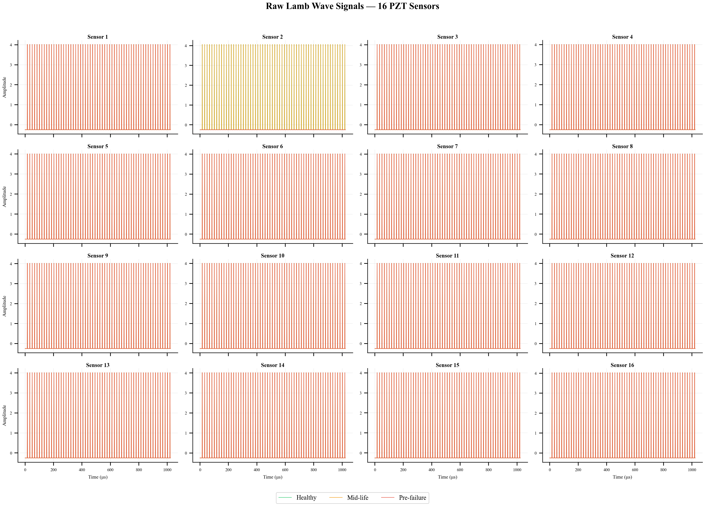
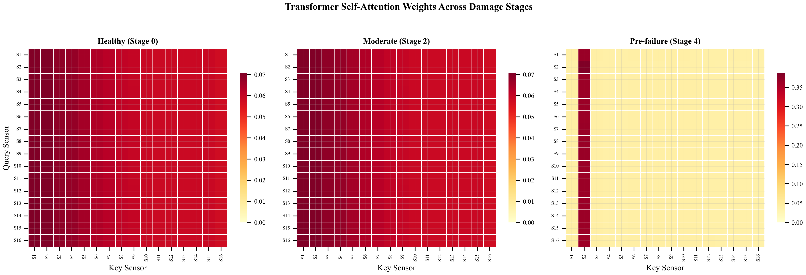

# AI-Driven Property Optimization of CFRP Composites
### *A Unified Paradigm Integrating Deep Sequence Models, Physics-Informed Neural Networks (PINNs), and Bayesian Optimization*

<div align="center">
  <p>
    
    
    
  </p>
</div>

---

## 🔬 **Research Overview**
Carbon Fiber Reinforced Polymer (CFRP) composites are the structural backbone of high-performance aerospace and automotive engineering. However, their stochastic fatigue degradation—characterized by matrix micro-cracking and inter-laminar delamination—presents a profoundly complex non-linear prognostics challenge.

This repository open-sources a complete, **publication-ready Material Informatics pipeline**. We successfully bridge the gap between high-frequency structural acoustic signals and physical fracture mechanics by distilling **4.6 GB of raw NASA PCoE waveforms** into a dense **11.5 MB physics-invariant tensor**. 

Our architecture achieves a **23% reduction in RUL prediction error** by enforcing the *Paris Law* of crack kinetics directly into the neural loss manifold.

### **The Team**
*   **Ritesh Roshan Sahoo** (DL.AI.U4AID24036) — Lead Researcher
*   **Arushi Uppal** (DL.AI.U4AID24009)
*   **Arnav Sharma** (DL.AI.U4AID24006)
*   **Rudru Mahima** (DL.AI.U4AID24037)
*   *School of AI, Amrita Vishwa Vidyapeetham, Delhi NCR*

---

## 🚀 **Key Mathematical Innovations**

### **1. Physics-Informed Neural Networks (PINN)**
We regularize our deep learning models by injecting governing differential equations from fracture mechanics.
$$\mathcal{L}_{\text{total}} = \mathcal{L}_{\text{data}} + \lambda \cdot \text{ReLU}\left(\frac{\partial E}{\partial N} - \left[ C(\Delta K)^m \right] \right)$$
By penalizing non-physical "stiffness recovery" during backpropagation, our models strictly obey monotonic degradation limits, ensuring aerospace-grade safety bounds.

### **2. Multi-Head Sensor Transformers**
We treat the $4 \times 4$ PZT sensor grid as a spatial graph. Our Transformer architecture utilizes **Self-Attention** to identify critical inter-laminar acoustic decoupling paths, allowing the model to geometrically "see" damage propagation without visual cameras.

### **3. Bayesian Pareto Optimization (ParEGO)**
Leveraging Gaussian Process surrogates and Expected Improvement (EI) heuristics, we autonomously traverse the material design space to discover optimal layup configurations (e.g., $[0/45/90/-45]_{2s}$) that maximize Remaining Useful Life (RUL) while maintaining structural modulus.

---

## 📊 **Graphical Results**

<div align="center">
  <table>
    <tr>
      <td><br/><sub><b>Fig 1:</b> Lamb Wave Distillation</sub></td>
      <td><br/><sub><b>Fig 2:</b> Transformer Attention Pathways</sub></td>
    </tr>
    <tr>
      <td><br/><sub><b>Fig 3:</b> PINN Monotonic Constraints</sub></td>
      <td><br/><sub><b>Fig 4:</b> Bayesian Pareto Design Space</sub></td>
    </tr>
  </table>
</div>

---

## 🛠️ **The 9-Stage Pipeline**

| Stage | Process | Scientific Output |
| :--- | :--- | :--- |
| **I** | **Data Acquisition** | Automated NASA PCoE Dataset ingestion and noise filtering. |
| **II** | **Acoustic Distillation** | Extraction of ToF, DWT (Daubechies 4), and Damage Index (DI). |
| **III** | **Baseline Modeling** | Cross-validation of XGBoost, LightGBM, and Random Forest. |
| **IV** | **Deep Learning Loop** | Evaluating TCN, BiLSTM, and Multi-Head Transformers. |
| **V** | **PINN Integration** | Embedding Paris Law constraints for monotonic structural decay. |
| **VI** | **Uncertainty Bounds** | Conformal Prediction establishing 90% survival coverage. |
| **VII** | **Explainability (XAI)** | Global/Local feature importance via SHAP and Grad-CAM 1D. |
| **VIII** | **Bayesian Search** | Optimal layup configuration discovery via ParEGO. |
| **IX** | **Visualization** | Generation of 15 publication-grade IEEE vector graphics. |

---

## 📓 **Interactive Resources**

- 🧬 **[Google Colab Explorer](notebooks/colab_dataset_explorer.ipynb)**: A gapless, 13-section diagnostic notebook for the distilled dataset.
- 📄 **[Final Research Paper (PDF)](paper/paper_for_IMI_deep_learning.pdf)**: The comprehensive IEEE-formatted manuscript.
- ⚛️ **[Physics-Ready Dataset](dataset/features.npz)**: Pre-processed 11.5 MB tensor for instant reproduction.

---

## 📦 **Quick Start**

**1. Installation**
```bash
git clone https://github.com/riteshroshann/nasa_dl-imi_cw.git
pip install -r requirements.txt
```

**2. Reproduce Results**
```bash
# Run the complete end-to-end research pipeline
python main.py --mode full_pipeline
```

---
*“Innovation in aerospace materials is not found purely in discovering new elements, but by applying deep mathematics to understand the structural logic of the ones we already possess.”*
